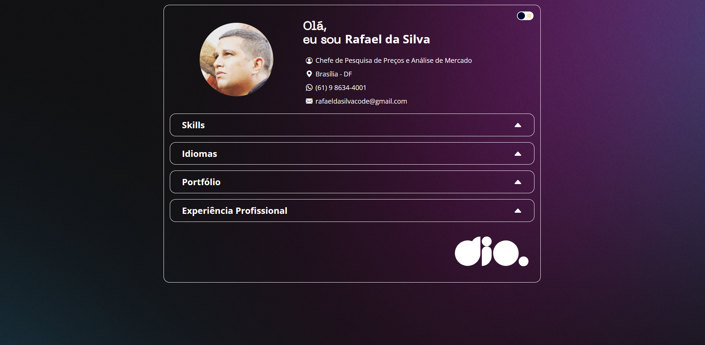

# 💼 Desafio: Portfólio Profissional no GitHub Pages
**Projeto:** Este repositório contém a solução do desafio **"Seu Portfólio Profissional"** da DIO.  
O objetivo é desenvolver uma página de portfólio totalmente dinâmica, consumindo dados de um arquivo **JSON** para exibir informações profissionais, experiências, habilidades e projetos.  

# 🎯 Deploy do Desafio
🔗 [Clique aqui para acessar a página](https://SEU-LINK-AQUI.github.io/)



# 🗂️ Estrutura do Projeto
```
📁 .github
┗ 📄 preview.png
📁 assets
┣ 📁 css
┃ ┣ 📄 acordeon.css
┃ ┣ 📄 experience.css
┃ ┣ 📄 footer.css
┃ ┣ 📄 global.css
┃ ┣ 📄 header.css
┃ ┣ 📄 languages.css
┃ ┣ 📄 portfolio.css
┃ ┗ 📄 skills.css
┣ 📁 fonts
┣ 📁 img
┗ 📁 js
┣ 📄 acordeon.js
┣ 📄 api.js
┣ 📄 main.js
┗ 📄 toggle.js
📁 data
┣ 📁 imgs
┗ 📄 profile.json
📄 .gitignore
📄 index.html
📄 README.md
```
# 🖥️ Tecnologias Utilizadas
- HTML5  
- CSS3  
- JavaScript  

# 📌 Regras do Desafio
### O que deve ser utilizado:
- Estruturação de página em **HTML**  
- Estilização modularizada com **CSS**  
- Manipulação de DOM com **JavaScript**  
- Consumo de dados via **JSON**  
- Deploy no **GitHub Pages**  

### Objetivo:
Construir um portfólio profissional que seja dinâmico e personalizável, permitindo:  
- Alterar os dados do perfil editando apenas o arquivo `profile.json`.  
- Exibir seções como: **habilidades, idiomas, portfólio e experiência profissional**.  

### Saída Esperada:
Uma página responsiva e dinâmica, que sirva como **vitrine profissional** para apresentar seus projetos e experiências.  

## 🔗 Links de Referência
- [Plataforma DIO](https://web.dio.me/)  
- [Deploy GitHub Pages](https://pages.github.com/)  

## 👨‍💻 Autor
- Desenvolvido por [Rafael Moreira](https://github.com/RafaeltiMoreira)  